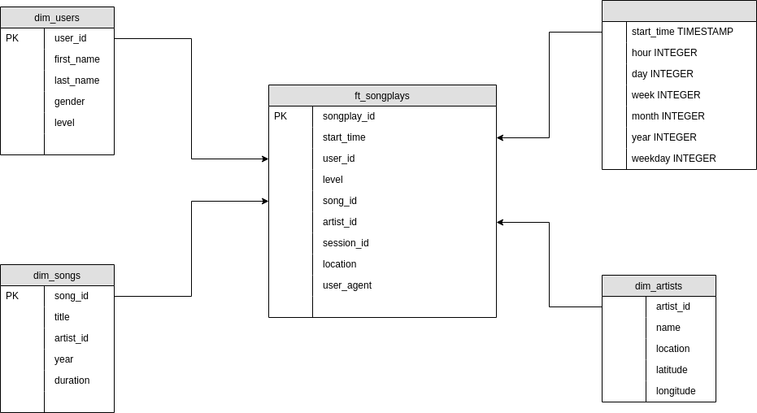
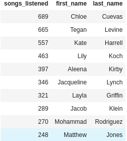
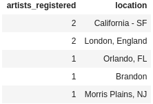
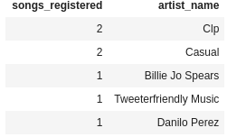

# udend-pj1

First project for Udacity Data Engineering Nanodegree.
This is an ETL script meant to load a Song/Artist database and a series of logs files of music listening.

## Introduction
A startup called Sparkify wants to analyze the data they've been collecting on songs and user activity on their new music streaming app. The analytics team is particularly interested in understanding what songs users are listening to. Currently, they don't have an easy way to query their data, which resides in a directory of JSON logs on user activity on the app, as well as a directory with JSON metadata on the songs in their app.

They'd like a data engineer to create a Postgres database with tables designed to optimize queries on song play analysis, and bring you on the project. Your role is to create a database schema and ETL pipeline for this analysis. You'll be able to test your database and ETL pipeline by running queries given to you by the analytics team from Sparkify and compare your results with their expected results.

## How to run the project:

1. Make sure you have a Postgres instance running in your environment and the connection parameters inside [create_tables.py](./create_tables.py) can make use of it.
2. Run [create_tables.py](./create_tables.py). This python script is meant for building the database with the star schema ready to use.
3. Run [etl.py](./etl.py). This python script is meant for loading the data inside `data/log_data` and `data/song_data` and inserting it to the database first into the dimension tables, then into the fact table respecting all the relations.
4. The result can be tested using [test.ipynb](./test.ipynb). You can feel free to create and run any desired query inside of it.

## The star schema

_Obs: You can check the tables DDL queries and aditional queries by looking into [sql_queries.py](./sql_queries.py)_

## Example queries

### Top 10 Users

`SELECT count(DISTINCT f.songplay_id) as songs_listened, u.first_name, u.last_name FROM ft_songplays f JOIN dim_users u ON u.user_id = f.user_id GROUP BY 2, 3 ORDER BY 1 DESC LIMIT 10;`

This query will return the user names from the users that most listened to music.

### Locations with most artists

`SELECT count(*) as artists_registered, location FROM dim_artists WHERE location <> '' GROUP BY 2 ORDER BY 1 DESC LIMIT 5;`

This query will return the top 5 locations that has the most registered artists, filtering the artists with a location.

### Artists with more songs

`SELECT count(distinct song_id), name as artist_name FROM dim_songs s JOIN dim_artists a ON s.artist_id = a.artist_id GROUP BY a.artist_id ORDER BY 1 DESC LIMIT 5;`

This query will return the top 5 artists with the most songs registered.

## Built With

* [Pandas](https://pandas.pydata.org/) - BSD-licensed library providing high-performance, easy-to-use data structures and data analysis tools.
* [Jupyter Notebook](https://jupyter.org/) - Editing and running notebook documents via a web browser.

## Authors

* **Udacity (initial work and project basis)** - [Udacity](https://www.udacity.com/)
* **Flavio Teixeira** - [ap3xx](https://github.com/ap3xx)
