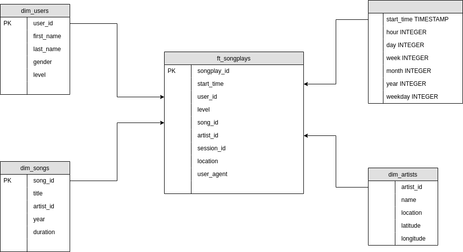
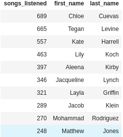
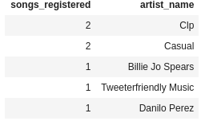

# udend-pj2

Data warehouse project for Udacity Data Engineering Nanodegree.
This is an ETL script meant to load a Song/Artist database and a series of logs files of music listening into a redshift cluster.

## Introduction

A startup called Sparkify wants to analyze the data they've been collecting on songs and user activity on their new music streaming app. The analytics team is particularly interested in understanding what songs users are listening to. Currently, they don't have an easy way to query their data, which resides in a directory of JSON logs on user activity on the app, as well as a directory with JSON metadata on the songs in their app.

They'd like a data engineer to create a Postgres database with tables designed to optimize queries on song play analysis, and bring you on the project. Your role is to create a database schema and ETL pipeline for this analysis. You'll be able to test your database and ETL pipeline by running queries given to you by the analytics team from Sparkify and compare your results with their expected results.

## Project Datasets

Two datasets that reside in S3:

* Song data: s3://udacity-dend/song_data
* Log data: s3://udacity-dend/log_data
    * Log data json path: s3://udacity-dend/log_json_path.json

### Song Dataset

The first dataset is a subset of real data from the Million Song Dataset. Each file is in JSON format and contains metadata about a song and the artist of that song. The files are partitioned by the first three letters of each song's track ID. For example, here are filepaths to two files in this dataset.

```
song_data/A/B/C/TRABCEI128F424C983.json
song_data/A/A/B/TRAABJL12903CDCF1A.json
```

And below is an example of what a single song file, TRAABJL12903CDCF1A.json, looks like.

`{"num_songs": 1, "artist_id": "ARJIE2Y1187B994AB7", "artist_latitude": null, "artist_longitude": null, "artist_location": "", "artist_name": "Line Renaud", "song_id": "SOUPIRU12A6D4FA1E1", "title": "Der Kleine Dompfaff", "duration": 152.92036, "year": 0}`

### Log Dataset

The second dataset consists of log files in JSON format generated by this event simulator based on the songs in the dataset above. These simulate app activity logs from an imaginary music streaming app based on configuration settings.

The log files in the dataset you'll be working with are partitioned by year and month. For example, here are filepaths to two files in this dataset.

```
log_data/2018/11/2018-11-12-events.json
log_data/2018/11/2018-11-13-events.json
```

And below is an example of what the data in a log file, 2018-11-12-events.json, looks like.


## The star schema


_Obs: You can check the tables DDL queries and aditional queries by looking into [sql_queries.py](./sql_queries.py)_

## How to run the project:

1. Make sure to have a running Redshift cluster.
2. Fill the [dwh.cfg](./dwh.cfg) file with the connection settings and IAM role.
3. Run [create_tables.py](./create_tables.py). This python script is meant for building the database with the staging tables and star schema ready to use.
4. Run [etl.py](./etl.py). This python script is meant for loading the data from `S3` using the `COPY` feature from `Redshift` into the `staging area` and then inserting it to the the fact and dimension tables.

## Example queries

### Top 10 Users

`SELECT count(DISTINCT f.songplay_id) as songs_listened, u.first_name, u.last_name FROM ft_songplays f JOIN dim_users u ON u.user_id = f.user_id GROUP BY 2, 3 ORDER BY 1 DESC LIMIT 10;`

This query will return the user names from the users that most listened to music.



### Locations with most artists

`SELECT count(*) as artists_registered, location FROM dim_artists WHERE location <> '' GROUP BY 2 ORDER BY 1 DESC LIMIT 5;`

This query will return the top 5 locations that has the most registered artists, filtering the artists with a location.


### Artists with more songs

`SELECT count(distinct song_id), name as artist_name FROM dim_songs s JOIN dim_artists a ON s.artist_id = a.artist_id GROUP BY a.artist_id ORDER BY 1 DESC LIMIT 5;`

This query will return the top 5 artists with the most songs registered.




## Authors

* **Udacity (initial work and project basis)** - [Udacity](https://www.udacity.com/)
* **Flavio Teixeira** - [ap3xx](https://github.com/ap3xx)
