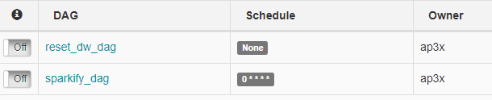
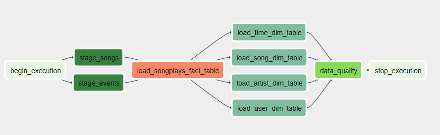
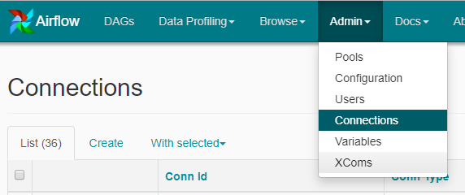
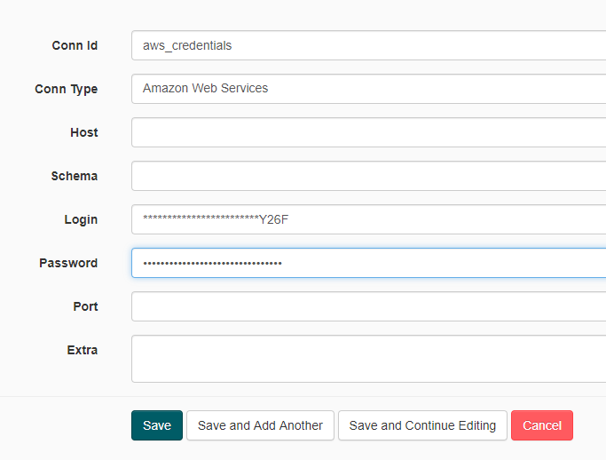
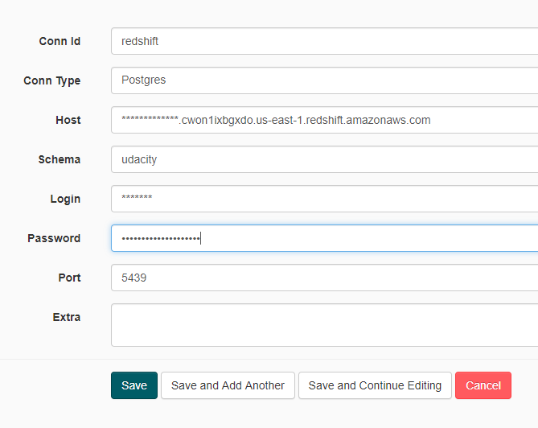
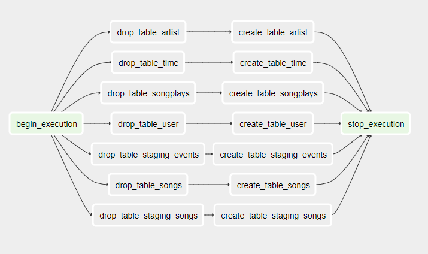

# udend-pj4

Fourth project for Udacity Data Engineering Nanodegree. 

## Introduction

A music streaming company, Sparkify, has decided that it is time to introduce more automation and monitoring to their data warehouse ETL pipelines and come to the conclusion that the best tool to achieve this is Apache Airflow.

## Project Description

This is an ETL Pipeline created using Apache Airflow that consists of developing an ETL job to read the files from an S3 bucket and load to an AWS Redshift Cluster in Staging Tables.

Subsequently the data is loaded on to the analysis tables from the staging tables. A Data Quality Check is performed to verify if the data is properly loaded on the Analysis tables.

## Dags list

## Main DAG graph view

## Connections configuration

Access the following menu to manage connections:

### AWS Connection

### Redshift Connection

## Extras

I've created an additional DAG meant to create the tables at Redshift, or recreated (droped then created again) for the following runs.

## Author

* [**Flavio Teixeira**](http://github.com/ap3xx)