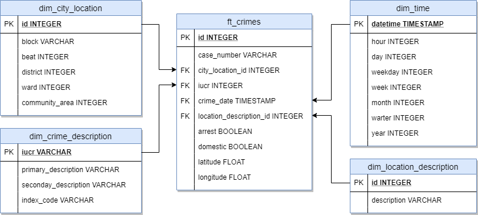
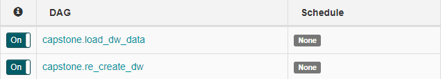
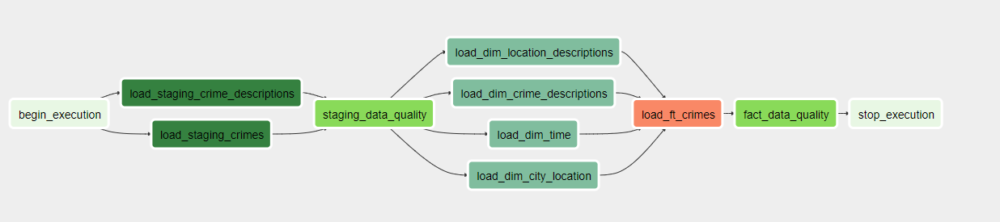
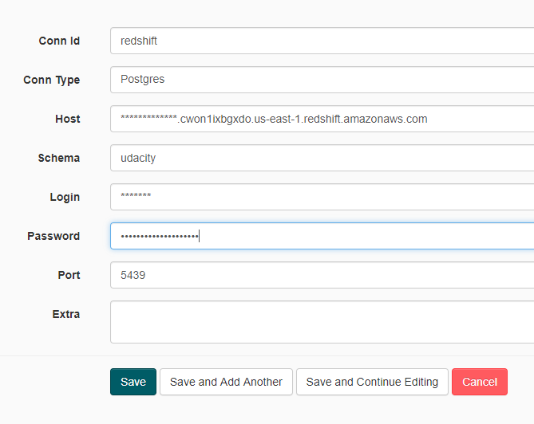
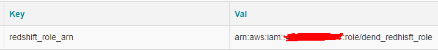
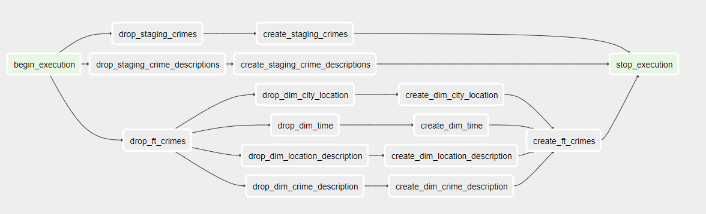

# udend-pjcapstone

This repository helds my Capstone for Data Engineering Nanodegree Enrollment.

In the following sections I will explain a little about my project in general.

## The database

I used for my project an simpler version of the Chicago crime data from Big Query, which I simplified removing some fields I did not intend to use and extracting it from BigQuery into partitioned CSVs. In addition to the Crime Data, I also extrated the Crime Code x Description into a single jsonlines file, which will serve the purpose of our crimes descriptions dimension.

TL;DR

* Chicago Crime Data - CSV (partitioned by year)
* Chicaco Crime Codes x Description - jsonlines

## Technologies I choose

* AWS Redshift
* Apache Airflow
* Jupyter (exploration purposes)

_Obs: for evaluation purposes I set my AWS S3 bucket public until you evaluate my project, it will be deleted afterwards..._

# The data

## About the data

My base is a modified version of this dataset: https://www.kaggle.com/chicago/chicago-crime

I choose the Chicago Crime Data because I think there is a lot to explore about it.
When you query the data thinking about space and time, a lot can be learnt about it, i.e.:
* How many crimes on each quarter happened each year?
* What is the relation between house and apartment when you think about domestic crimes?
* What are the most dangerous districts?

This kind of result can be used for governamental purposes or even for for comercial purposes.

## Data sample

Here as some snippets of the files consumed by the ETL pipeline.

### Crimes Codes x Descriptions

```json
{"IUCR":"110","PRIMARY DESCRIPTION":"HOMICIDE","SECONDARY DESCRIPTION":"FIRST DEGREE MURDER","INDEX CODE":"I"}
{"IUCR":"130","PRIMARY DESCRIPTION":"HOMICIDE","SECONDARY DESCRIPTION":"SECOND DEGREE MURDER","INDEX CODE":"I"}
{"IUCR":"141","PRIMARY DESCRIPTION":"HOMICIDE","SECONDARY DESCRIPTION":"INVOLUNTARY MANSLAUGHTER","INDEX CODE":"N"}
{"IUCR":"142","PRIMARY DESCRIPTION":"HOMICIDE","SECONDARY DESCRIPTION":"RECKLESS HOMICIDE","INDEX CODE":"N"}
{"IUCR":"261","PRIMARY DESCRIPTION":"CRIM SEXUAL ASSAULT","SECONDARY DESCRIPTION":"AGGRAVATED: HANDGUN","INDEX CODE":"I"}
{"IUCR":"262","PRIMARY DESCRIPTION":"CRIM SEXUAL ASSAULT","SECONDARY DESCRIPTION":"AGGRAVATED: OTHER FIREARM","INDEX CODE":"I"}
{"IUCR":"263","PRIMARY DESCRIPTION":"CRIM SEXUAL ASSAULT","SECONDARY DESCRIPTION":"AGGRAVATED: KNIFE\/CUT INSTR","INDEX CODE":"I"}
{"IUCR":"264","PRIMARY DESCRIPTION":"CRIM SEXUAL ASSAULT","SECONDARY DESCRIPTION":"AGGRAVATED: OTHER DANG WEAPON","INDEX CODE":"I"}
{"IUCR":"265","PRIMARY DESCRIPTION":"CRIM SEXUAL ASSAULT","SECONDARY DESCRIPTION":"AGGRAVATED: OTHER","INDEX CODE":"I"}
{"IUCR":"266","PRIMARY DESCRIPTION":"CRIM SEXUAL ASSAULT","SECONDARY DESCRIPTION":"PREDATORY","INDEX CODE":"I"}
```

### Crime Data

```csv
ID,Case Number,Date,Block,IUCR,Location Description,Arrest,Domestic,Beat,District,Ward,Community Area,Latitude,Longitude
11835726,JC442096,09/20/2019 11:58:00 PM,083XX S KILDARE AVE,143A,RESIDENTIAL YARD (FRONT/BACK),false,false,834,8,18,70,41.741390385,-87.728935069
11563850,JC113322,01/11/2019 05:48:00 PM,009XX W FULLERTON AVE,0820,SIDEWALK,false,false,1812,18,43,7,41.925394137,-87.652509775
11835679,JC442067,09/20/2019 11:47:00 PM,001XX W WENDELL ST,2024,VEHICLE NON-COMMERCIAL,true,false,1824,18,2,8,41.90133474,-87.633667905
11564157,JC113250,01/11/2019 05:45:00 PM,079XX S GREENWOOD AVE,0496,SIDEWALK,false,true,624,6,8,44,41.750547026,-87.597894925
11835751,JC442060,09/20/2019 11:47:00 PM,062XX S YALE AVE,041A,SIDEWALK,false,false,711,7,20,68,41.780024448,-87.631835099
11564020,JC113290,01/11/2019 05:45:00 PM,079XX S WABASH AVE,0486,APARTMENT,true,true,623,6,6,44,41.749999492,-87.622967453
11835778,JC442138,09/20/2019 11:45:00 PM,065XX S MINERVA AVE,0810,STREET,false,false,321,3,20,42,41.776265645,-87.597322542
11563814,JC113284,01/11/2019 05:45:00 PM,057XX S MAY ST,1811,SIDEWALK,true,false,712,7,16,68,41.78971606,-87.653543981
11835728,JC442104,09/20/2019 11:45:00 PM,005XX N RUSH ST,0820,SIDEWALK,false,false,1834,18,42,8,41.892002902,-87.625373807
11564085,JC113338,01/11/2019 05:45:00 PM,085XX S COTTAGE GROVE AVE,0860,DEPARTMENT STORE,true,false,632,6,6,44,41.739265865,-87.604893749
```

## The Data Warehouse model



Besides this main Star Schema, there will also be two staging tables for the raw data.

# Airflow

## Dags list



## The ETL flow



## Connections configuration

### Redshift Connection



## Variables configuration

### Redshift Arn Variable



## Addressing Other Scenarios (What if?)

### **What if** the data was increased by 100x?

> The chosen technologies are easily scallabe (both vertically and horizontally), so data increase is not a big problem.

### **What if** the pipelines would be run on a daily basis by 7 am every day?

> I would need to change how some data are consumed and create some upsert strategy, mainly for dimension tables. The scheduling is held by Airflow naturally.

### **What if** the database needed to be accessed by 100+ people?

> Redshift can handle this kind of access and if the people are well instruded on how Redshift works and performs, this can be achieved even with a not so big cluster.

## Extras

I've created an additional DAG meant to create the tables at Redshift, or recreated (droped then created again) for the following runs.



## Author

* **Flávio Teixeira** - [ap3xx](http://github.com/ap3xx)